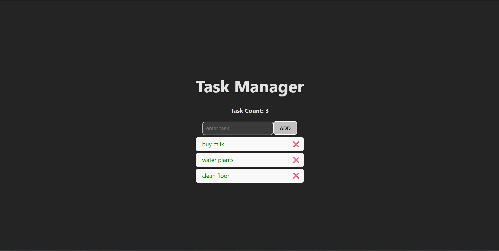

# Task Manager App 

A simple and responsive task manager (to-do list) built with **React + Vite**.  
This project allows users to add, mark complete, and delete tasks easily.

---

##  Features

- Add new tasks
- Mark tasks as completed
- Delete tasks
- Task counter
- Clean and simple UI with CSS styling

---

##  Tech Stack

- [React](https://react.dev/) (UI library)
- [Vite](https://vitejs.dev/) (build tool)
- CSS (for styling)

---

##  Project Setup

1. Clone this repository:
   ```bash
   git clone https://github.com/Nandhagopal2912/react-task-manager.git
   ```

## Screenshot


